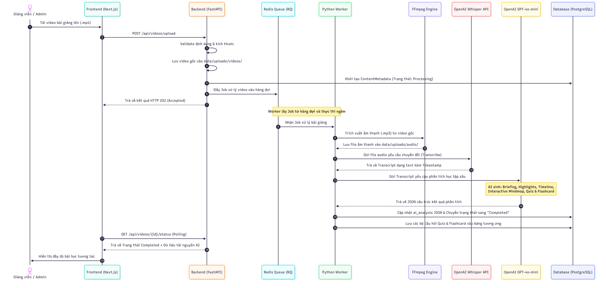
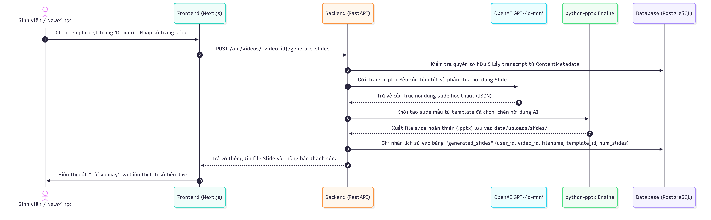
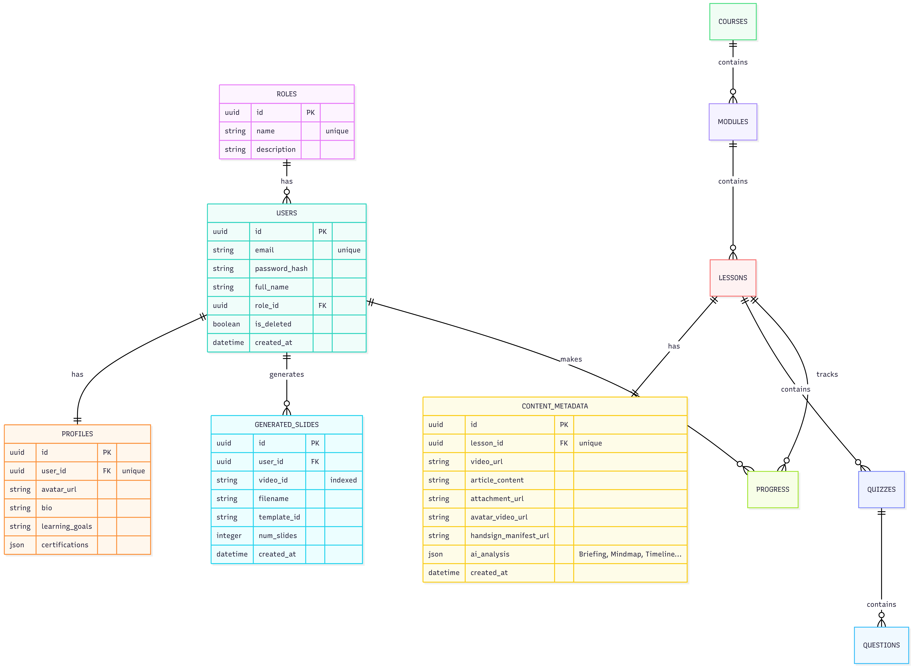
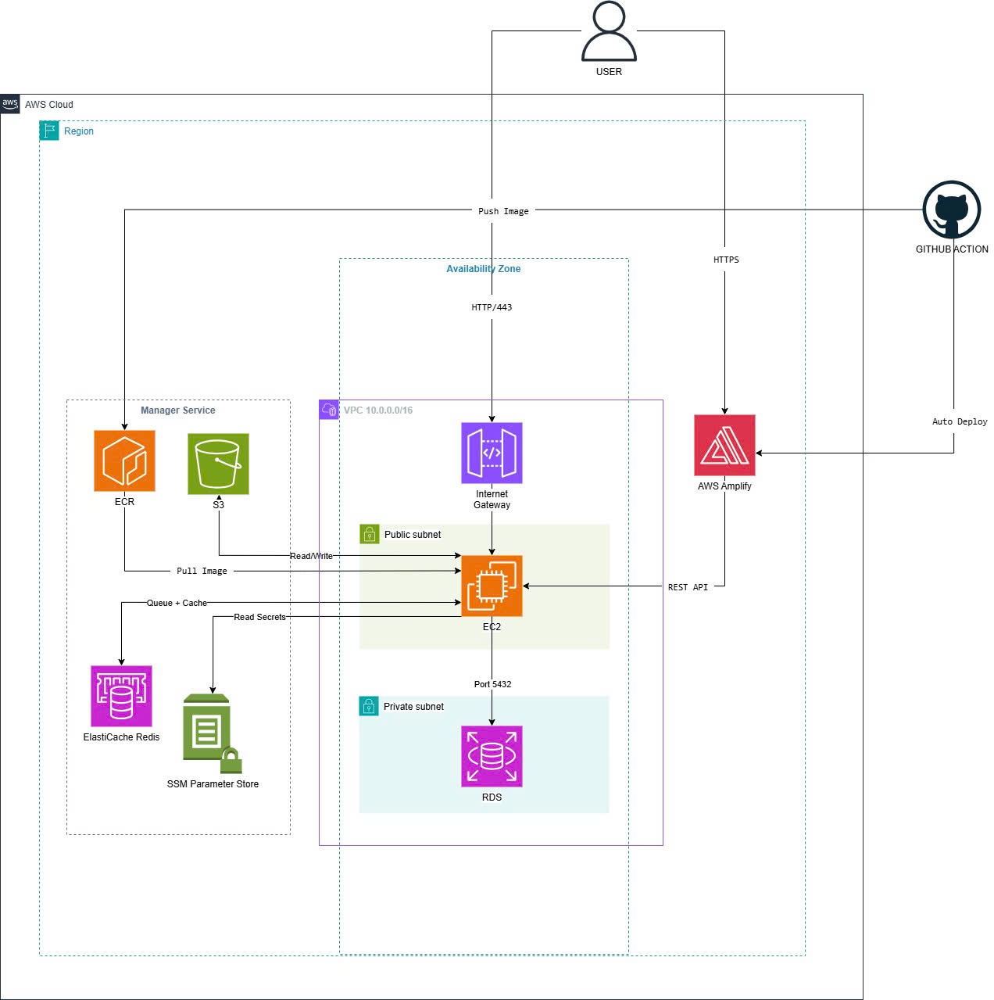

# 🏗️ Kiến Trúc Hệ Thống & Thiết Kế Cơ Sở Dữ Liệu — Dreams

Tài liệu này mô tả chi tiết thiết kế hệ thống, luồng dữ liệu xử lý bất đồng bộ tích hợp các mô hình AI và cấu trúc cơ sở dữ liệu (Database Schema) của dự án **Dreams (Mã dự án: A20-App-075)**.

---

## 🔗 Quick Links
*   **Trang chủ Dự án:** [README.md](../README.md)
*   **Báo cáo Đánh giá (Evaluation):** [docs/evaluation-report.md](evaluation-report.md)
*   **Nhật ký Phát triển (Worklog):** [docs/worklog.md](worklog.md)

---

## 1. 📊 Sơ đồ kiến trúc tổng quan

Kiến trúc hệ thống của Dreams được thiết kế dưới dạng phân lớp rõ ràng (Multi-tier Architecture) nhằm đảm bảo hiệu năng và khả năng bảo mật cao nhất:


> [!NOTE]
> Mã nguồn sơ đồ Mermaid chi tiết được lưu trữ tại file [docs/architecture.mmd](architecture.mmd). Bạn có thể sao chép mã nguồn này dán vào bất kỳ trình biên dịch Mermaid nào để chỉnh sửa sơ đồ.

---

## 🔄 2. Các luồng dữ liệu chính (Data Flow)

### 🌊 Luồng 1: Xử lý Video Bài giảng & Tự động tạo Tài nguyên AI (Video Processing Flow)
Đây là luồng cốt lõi, chạy hoàn toàn bất đồng bộ (Asynchronous) thông qua hàng đợi Redis Queue (RQ) nhằm tránh nghẽn luồng chính của FastAPI:




---

### 🌊 Luồng 2: Sinh Slide Tự động & Lưu trữ Lịch sử (AI Slide Generation Flow)
Tối ưu hóa khả năng tương tác bằng cách cho phép sinh slide tức thì dựa trên transcript học thuật và lưu vết lịch sử:



---

## 🗄️ 3. Thiết kế cơ sở dữ liệu (Database Schema)

Cơ sở dữ liệu của Dreams được chuẩn hóa ở dạng quan hệ (Relational Database) và cấu hình qua các model **SQLModel (SQLAlchemy)**:



### 📋 Mô tả chi tiết các bảng chính:

#### 1. Bảng `users` (Quản lý Người dùng)
Lưu trữ thông tin cơ bản và vai trò của người học cũng như ban quản trị.
*   `id` (UUID, Primary Key): Định danh duy nhất của người dùng.
*   `email` (String, Unique): Email dùng để đăng nhập.
*   `password_hash` (String): Mật khẩu được mã hóa an toàn (bcrypt).
*   `full_name` (String, Optional): Họ và tên của thành viên.
*   `role_id` (UUID, Foreign Key): Liên kết tới bảng vai trò `roles`.
*   `is_deleted` (Boolean): Soft-delete để tránh mất mát dữ liệu.
*   `created_at` (Datetime): Thời gian đăng ký tài khoản.

#### 2. Bảng `roles` (Vai trò & Phân quyền)
Định nghĩa các vai trò trong hệ thống (admin, teacher, student).
*   `id` (UUID, Primary Key): Định danh duy nhất của vai trò.
*   `name` (String, Unique): Tên vai trò duy nhất.
*   `description` (String, Optional): Mô tả chi tiết vai trò.

#### 3. Bảng `profiles` (Thông tin Cá nhân)
Lưu trữ thông tin bổ sung và tiến độ học tập của người dùng.
*   `id` (UUID, Primary Key): Định danh duy nhất.
*   `user_id` (UUID, Foreign Key, Unique): Liên kết 1-1 tới người dùng.
*   `avatar_url` (String, Optional): Đường dẫn ảnh đại diện.
*   `bio` (String, Optional): Tiểu sử ngắn của người học.
*   `learning_goals` (String, Optional): Mục tiêu học tập cá nhân.
*   `certifications` (JSON, Optional): Danh sách chứng chỉ đã đạt được dưới dạng JSON.

#### 4. Bảng `content_metadata` (Dữ liệu Xử lý Video & AI)
Lưu trữ toàn bộ thông tin video và kết quả phân tích AI bất đồng bộ phục vụ người khiếm thính.
*   `id` (UUID, Primary Key): Định danh duy nhất.
*   `lesson_id` (UUID, Foreign Key, Unique): Liên kết 1-1 tới bảng bài học `lessons`.
*   `video_url` (String, Optional): Đường dẫn lưu trữ video bài giảng.
*   `article_content` (String, Optional): Nội dung bài đọc học thuật bổ trợ.
*   `attachment_url` (String, Optional): Tài liệu đính kèm bài học.
*   `avatar_video_url` (String, Optional): Đường dẫn file video ký hiệu số (Avatar VSL).
*   `handsign_manifest_url` (String, Optional): File cấu hình cử điệu bàn tay.
*   `ai_analysis` (JSON, Optional): Cột dữ liệu JSON linh hoạt lưu trữ toàn bộ:
    *   `briefing`: Mục tiêu bài học và từ khóa.
    *   `highlights`: Tóm tắt các điểm nhấn chính.
    *   `timeline`: Các mốc phân đoạn thời gian.
    *   `mindmap`: Sơ đồ cây (các node đều có nhúng mốc timestamp nhảy giây video).
*   `created_at` (Datetime): Thời gian khởi tạo/upload bài giảng.

#### 5. Bảng `generated_slides` (Quản lý Lịch sử Slide AI)
Bảo toàn lịch sử tạo giáo án bằng AI của người học để phục vụ tải xuống mọi lúc mọi nơi.
*   `id` (UUID, Primary Key): Định danh duy nhất.
*   `user_id` (UUID, Foreign Key): Liên kết tới người dùng thực hiện tạo slide.
*   `video_id` (String, Indexed): Định danh của video làm nguồn nội dung.
*   `filename` (String): Tên file slide đã sinh dạng `.pptx` được lưu trữ vật lý trên disk.
*   `template_id` (String): Mã định danh mẫu template (1-10) đã sử dụng.
*   `num_slides` (Integer): Số lượng trang slide được yêu cầu tạo.
*   `created_at` (Datetime): Thời gian thực hiện yêu cầu tạo.

---

## ☁️ 4. Sơ đồ hạ tầng AWS & Triển khai Đám mây (AWS Cloud Infrastructure Diagram)

Dưới đây là sơ đồ hạ tầng triển khai đám mây AWS thực tế của hệ thống Dreams:



### 4.1 Tổng quan kiến trúc

> **Region**: ap-southeast-1 (Singapore)  

Hệ thống là một **nền tảng học tập video với AI**, gồm 3 tầng chính:

| Tầng | Công nghệ | Nơi chạy |
|---|---|---|
| Frontend | Next.js + React | AWS Amplify |
| Backend API | FastAPI (Python 3.12) + RQ Worker | EC2 t3.micro (Docker) |
| Data | PostgreSQL + Redis | RDS + ElastiCache |
| Storage | Video, Audio, Transcript, Slides | S3 |

---

### 4.2 Luồng hoạt động chi tiết

#### Luồng 1 — CI/CD Deploy (GitHub Action)

```text
Developer push code lên GitHub
  └─► GitHub Action trigger

GitHub Action thực hiện 2 việc song song:
  ├─► [1] Build Docker image → Push lên ECR
  │         ECR lưu tối đa 5 image gần nhất (lifecycle policy)
  │         Image scan tự động khi push
  │
  └─► [2] Auto Deploy → AWS Amplify
            Amplify build Next.js từ src/frontend/
            Inject env: NEXT_PUBLIC_API_URL
            Deploy lên *.amplifyapp.com
```

**Kết quả**: Code mới được deploy tự động, không cần SSH vào server.

#### Luồng 2 — User truy cập Frontend

```text
User mở trình duyệt
  └─► HTTPS → AWS Amplify (CDN toàn cầu)
        └─► Trả về Next.js app (HTML/JS/CSS)
              └─► Frontend load xong, gọi REST API về EC2
```

**Chi tiết authentication**:
```text
User nhập email + password
  └─► POST /api/auth/login → EC2 FastAPI
        ├─► Bcrypt verify password với hash trong RDS
        ├─► Tạo JWT token (HS256, hết hạn 24h)
        └─► Trả về token → Frontend lưu vào Cookie (Secure, SameSite=lax)

Mọi request tiếp theo:
  └─► Header: Authorization: Bearer <token>
        └─► FastAPI decode JWT → xác định user + role
              ├─► student  → /student/*
              └─► admin    → /admin/*
```

#### Luồng 3 — User upload Video / YouTube URL

```text
User chọn file hoặc paste YouTube URL
  └─► POST /api/videos → EC2 FastAPI

EC2 FastAPI xử lý:
  ├─► Nếu YouTube URL: yt-dlp download video
  ├─► Nếu file upload: nhận multipart form data
  ├─► Lưu video lên S3 (s3://bucket/videos/)
  ├─► Tạo ProcessingJob trong RDS (status: queued)
  └─► Enqueue job vào Redis Queue (video-pipeline)

RQ Worker (cùng EC2, Docker container riêng) nhận job:
  │
  ├─► [Bước 1] FFmpeg extract audio → s3://bucket/audio/
  │             (Audio tự xóa sau 30 ngày — S3 lifecycle rule)
  │
  ├─► [Bước 2] Faster-Whisper transcribe audio
  │             Hỗ trợ: Tiếng Việt + Tiếng Anh
  │             Output: JSON với timestamps → s3://bucket/transcripts/
  │
  ├─► [Bước 3] OpenAI GPT-4o-mini xử lý transcript
  │             ├─► Dịch (VI ↔ EN nếu cần)
  │             ├─► Tóm tắt nội dung (Summary)
  │             ├─► Tạo câu hỏi ôn tập (Quiz questions)
  │             ├─► Tạo briefing ngắn gọn
  │             └─► Lưu kết quả → s3://bucket/ai_results/
  │
  ├─► [Bước 4] python-pptx tạo Slide PowerPoint
  │             Template từ AI output → s3://bucket/slides/
  │
  ├─► [Bước 5] Tạo dữ liệu Mindmap (JSON)
  │
  ├─► [Bước 6 - Optional] Replicate API
  │             Tạo Avatar video ngôn ngữ ký hiệu
  │             Model: black-forest-labs/flux-1.1-pro
  │             Output → s3://bucket/avatar_videos/
  │
  └─► [Hoàn tất] Cập nhật ProcessingJob status: completed
                  Frontend poll job status → hiển thị kết quả

Trạng thái job:
  queued → downloading → extracting_audio → transcribing
  → translating → ai_processing → completed / failed
```

#### Luồng 4 — EC2 đọc Secrets khi khởi động

```text
EC2 instance start (từ ECR image)
  └─► User Data script chạy docker-compose
        └─► FastAPI container khởi động
              └─► Đọc secrets từ SSM Parameter Store:
                    ├─► /a20/prod/SECRET_KEY        (JWT signing key)
                    ├─► /a20/prod/OPENAI_API_KEY    (GPT-4o-mini)
                    ├─► /a20/prod/REPLICATE_API_TOKEN
                    └─► /a20/prod/CORS_ALLOW_ORIGINS
```

**Lý do dùng SSM**: Không hardcode secrets trong code hoặc environment file.  
IAM Role của EC2 có quyền `ssm:GetParameter` — không cần access key/secret key.

#### Luồng 5 — EC2 kết nối các Managed Services

```text
EC2 (FastAPI + RQ Worker)
  │
  ├─► RDS PostgreSQL          (Port 5432, Private Subnet)
  │     Đọc/ghi: users, courses, lessons, quiz, progress
  │     Security Group: chỉ cho phép EC2 → RDS, không public
  │
  ├─► ElastiCache Redis        (Queue + Cache)
  │     ├─► RQ job queue: video-pipeline jobs
  │     ├─► Rate limiting: 10 login/phút, 20 upload/giờ
  │     └─► Session cache
  │
  ├─► S3 Bucket               (Read/Write)
  │     ├─► Upload: video, audio, transcript, slides, covers
  │     ├─► Download: presigned URL cho user (temporary public access)
  │     └─► Lifecycle: audio tự xóa sau 30 ngày
  │
  └─► SSM Parameter Store      (Read Secrets)
        Chỉ đọc khi container khởi động
```

---

### 4.3 Chi phí AWS — ap-southeast-1 (Singapore)

#### 4.3.1 Chi phí từng service

| Service | Loại instance/tier | Đơn giá | Giờ/tháng | Chi phí/tháng |
|---|---|---|---|---|
| **EC2** | t3.micro (24/7) | $0.0104/giờ | 730h | **~$7.60** |
| **RDS PostgreSQL** | db.t3.micro (24/7) | $0.022/giờ | 730h | **~$16.06** |
| **RDS Storage** | 20GB gp2 | $0.115/GB/tháng | — | **~$2.30** |
| **ElastiCache Redis** | cache.t3.micro (24/7) | $0.017/giờ | 730h | **~$12.41** |
| **S3 Storage** | 10GB | $0.025/GB/tháng | — | **~$0.25** |
| **S3 Requests** | PUT + GET | $0.005/1,000 PUT | — | **~$0.50** |
| **ECR** | 2GB images (5 versions) | $0.10/GB/tháng | — | **~$0.20** |
| **AWS Amplify** | Hosting + Build | $0.023/GB served | — | **~$1–3** |
| **SSM Parameter Store** | Standard params | Free | — | **$0** |
| **Data Transfer Out** | ~10GB/tháng | $0.09/GB | — | **~$0.90** |

#### 4.3.2 Tổng chi phí ước tính

| Scenario | Mô tả | Chi phí/tháng |
|---|---|---|
| **Minimal** | Ít user (<20), ít video upload | ~**$41/tháng** |
| **Moderate** | 50–100 user, 20–50 video/tháng | ~**$55–70/tháng** |
| **Tối ưu** | Redis chạy trên EC2 (Docker), không dùng ElastiCache riêng | ~**$29/tháng** |

> **Gợi ý tiết kiệm**: Với dự án nhỏ/demo, chạy Redis như Docker container trên cùng EC2 thay vì dùng ElastiCache độc lập → **tiết kiệm ~$12.41/tháng**.  
> ElastiCache chỉ cần thiết khi cần high availability hoặc >1 EC2 instance.

---

### 4.4 AWS Free Tier (12 tháng đầu)

| Service | Free Tier hàng tháng | Chi phí với Free Tier |
|---|---|---|
| EC2 t2.micro | 750 giờ/tháng | **~$0** |
| RDS db.t2.micro | 750 giờ + 20GB storage + 20GB backup | **~$0** |
| S3 | 5GB storage + 20,000 GET + 2,000 PUT | **~$0** |
| AWS Amplify | 1,000 build phút + 15GB served + 5GB storage | **~$0** |
| ECR | 500MB/tháng | **~$0** (nếu image < 500MB) |
| SSM Parameter Store | Unlimited standard params | **$0** |
| **ElastiCache** | Không có Free Tier | **~$12.41** |
| **Data Transfer** | 1GB/tháng miễn phí, sau đó $0.09/GB | **~$0.81** (9GB tính phí) |

#### Tổng với Free Tier

| Tháng | Chi phí ước tính |
|---|---|
| Tháng 1–12 (Free Tier) | **~$13–15/tháng** (chủ yếu ElastiCache + Data Transfer) |
| Tháng 13+ (hết Free Tier) | **~$41–45/tháng** |

> **Lưu ý**: Free Tier chỉ áp dụng cho tài khoản AWS mới. EC2 Free Tier là **t2.micro**, không phải t3.micro — cần chỉnh lại Terraform nếu muốn dùng Free Tier.

---

### 4.5 So sánh kịch bản triển khai

| Kịch bản | Cấu hình | Chi phí/tháng | Phù hợp |
|---|---|---|---|
| **Dev/Demo** | EC2 t2.micro + SQLite + Redis on EC2 | ~$0–5 | Test nội bộ, demo |
| **Free Tier** | EC2 t2.micro + RDS t2.micro + Redis on EC2 | ~$13–15 | Pilot, ít user |
| **Production nhỏ** | EC2 t3.micro + RDS t3.micro + Redis on EC2 | ~$29 | <100 user |
| **Production chuẩn** | EC2 t3.micro + RDS t3.micro + ElastiCache | ~$41–45 | 100–500 user |
| **Production scale** | EC2 t3.small + RDS t3.small + ElastiCache | ~$65–80 | 500+ user |

---

### 4.6 Cấu trúc S3 Bucket

```text
s3://{project}-{env}-uploads-{account-id}/
  ├── videos/           # Video gốc (không tự xóa)
  ├── audio/            # Audio extract từ video (tự xóa sau 30 ngày)
  ├── transcripts/      # JSON transcript với timestamps
  ├── ai_results/       # Kết quả AI: summary, quiz, briefing
  ├── covers/           # Ảnh bìa generate bởi OpenAI
  ├── slides/           # PowerPoint slides
  ├── slide_thumbnails/ # Preview ảnh slide
  └── avatar_videos/    # Video avatar ngôn ngữ ký hiệu
```

**S3 Lifecycle Rules**:
- `audio/*` → Tự động xóa sau **30 ngày** (tiết kiệm storage)
- Non-current versions → Expire sau **90 ngày**

---

### 4.7 Security Architecture

| Lớp bảo mật | Cơ chế |
|---|---|
| **Network** | RDS trong Private Subnet, không có public IP |
| **EC2 → RDS** | Security Group: chỉ port 5432 từ EC2 SG |
| **Secrets** | SSM Parameter Store, không hardcode trong code |
| **Auth** | JWT HS256, bcrypt password hash, 24h expiry |
| **Rate Limiting** | Redis-backed: 10 login/phút, 20 upload/giờ |
| **S3** | Block public access, presigned URL cho download |
| **EC2 SSH** | Chỉ cho phép từ Admin IP cụ thể (Security Group) |
| **HTTPS** | Amplify tự cấp SSL, EC2 sau Load Balancer (nếu có) |
