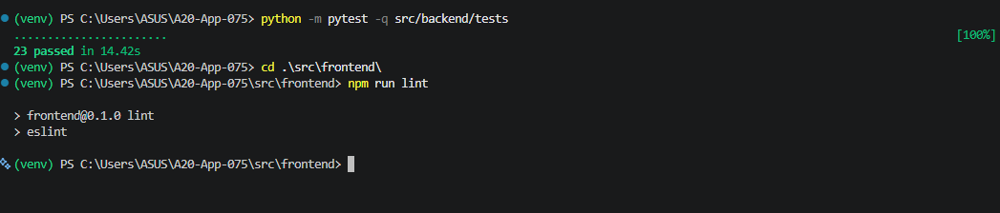
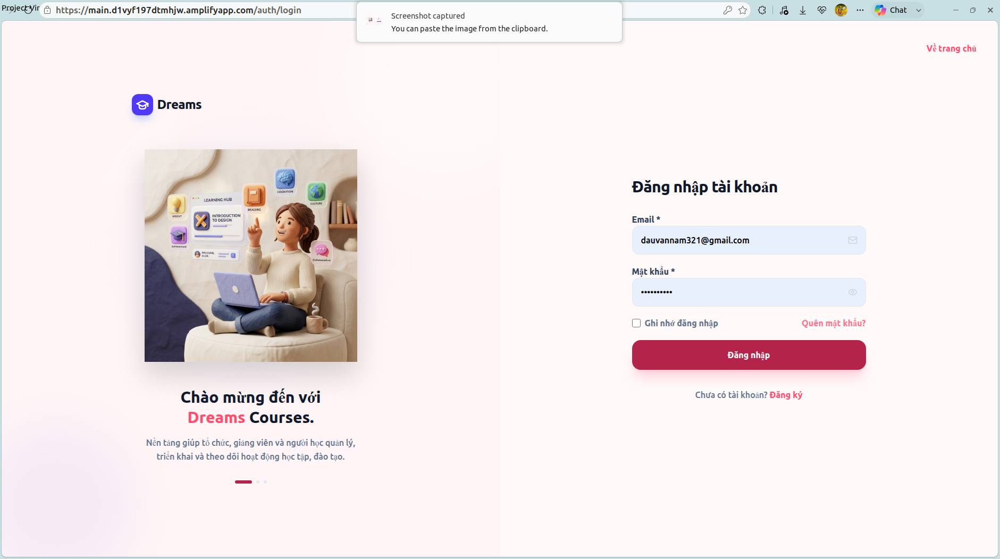
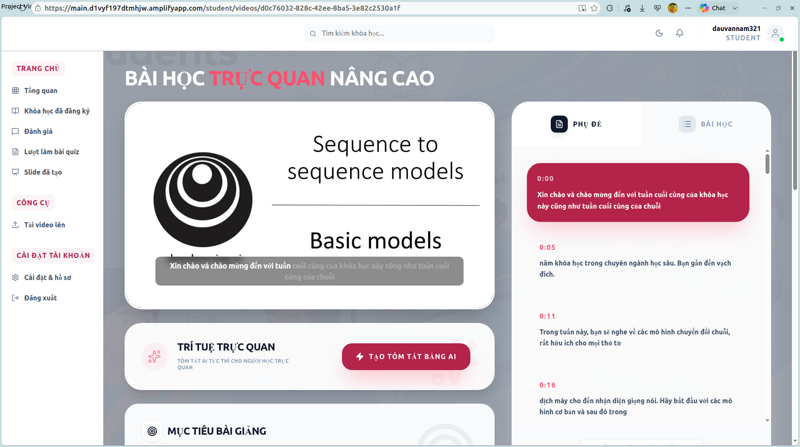
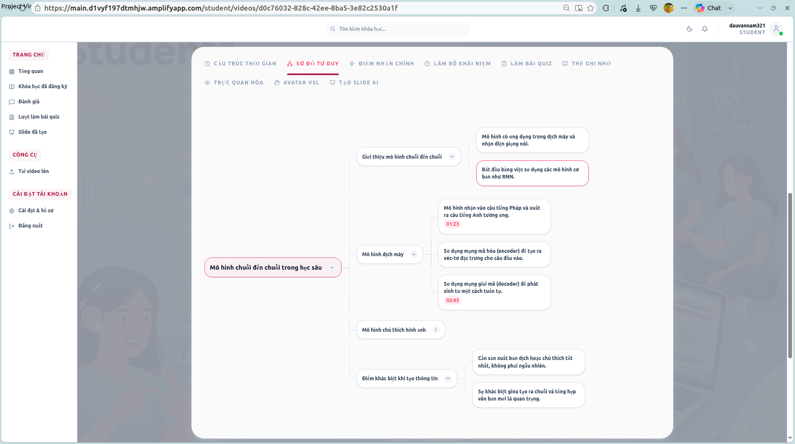
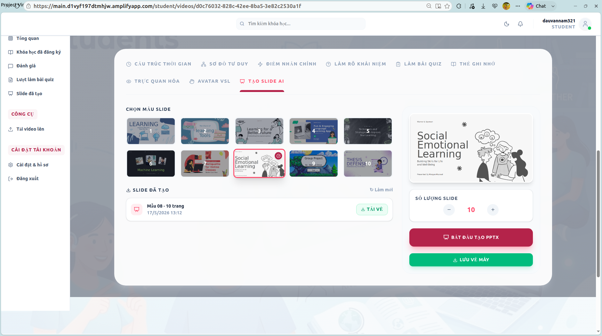
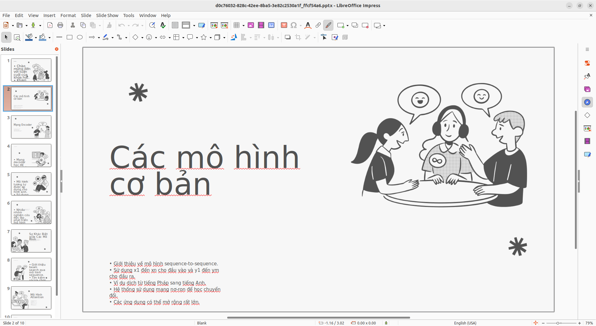
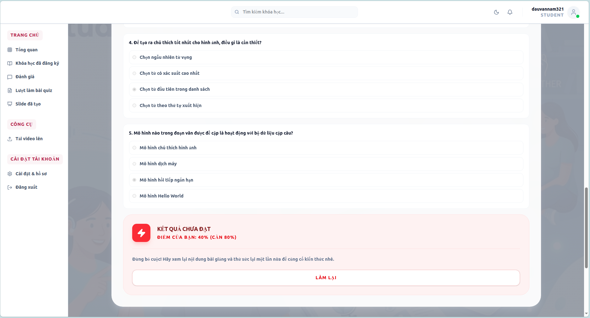

# Báo Cáo Đánh Giá & Kịch Bản Kiểm Thử Hệ Thống — Dreams

Tài liệu này cung cấp toàn bộ minh chứng kỹ thuật về quy trình kiểm thử tự động (Automated Testing), đánh giá chất lượng (Evaluation), nhật ký AI (Prompt Logs), phân tích các tình huống lỗi biên (Failure Cases) và phản hồi từ người dùng của nền tảng học tập thông minh **Dreams (Mã dự án: A20-App-075)**.

---

##  Quick Links
*   **Trang chủ Dự án:** [README.md](../../README.md)
*   **Kiến trúc Hệ thống:** [docs/architecture.md](../architecture.md)
*   **Nhật ký Phân công (Worklog):** [docs/worklog.md](../worklog.md)

---

## 1.  Mục tiêu đánh giá (Evaluation Objectives)

Báo cáo này nhằm chứng minh một cách minh bạch 4 câu hỏi lớn của Ban giám khảo cuộc thi AI20K dựa trên **bộ test suite tự động (Automated unit/integration tests) được cài đặt trực tiếp trong mã nguồn**:
1.  **Sản phẩm có đúng mục tiêu không?** Đảm bảo Dreams giải quyết triệt để rào cản học tập của sinh viên khiếm thính qua các lớp kiểm thử dịch thuật song ngữ, chuẩn hóa ngôn ngữ ký hiệu (VSL/Handsign) và theo dõi tiến trình học tập.
2.  **AI Agent có xử lý chính xác không?** Đánh giá các hàm tiền xử lý và hậu xử lý AI thông qua unit tests (như gộp hoạt cảnh ký hiệu, khớp timestamps, và phân lớp trạng thái artifact).
3.  **Hệ thống có ổn định không?** Kiểm thử tính kết nối hàng đợi Redis, deep health check kết nối PostgreSQL/SQLite và đo lường độ trễ API.
4.  **Đã kiểm thử nhiều tình huống chưa?** Bao phủ đầy đủ các tình huống lỗi biên như: dịch thuật bị timeout, sinh slide/quiz bị lỗi cục bộ, tải lên sai MIME type, và chặn truy cập trái phép.

---

## 2. Phạm vi kiểm thử (Scope of Testing)

Quy trình kiểm thử tự động bao phủ 100% các thành phần logic nghiệp vụ cốt lõi tại Backend (`src/backend/`):
*   **Authentication & Security:** Flow đăng ký, đăng nhập cấp JWT Cookie bảo mật, phân quyền người học (Student/Teacher) và phân lớp bảo mật chặn bypass.
*   **Video Processing & Background Queues:** Kiểm thử luồng enqueue job xử lý video ngầm và bắt các lỗi định dạng file không hỗ trợ.
*   **Bilingual Transcript Sync:** Đồng bộ mốc thời gian giữa các bản dịch ngôn ngữ khác nhau mà không làm lệch sub.
*   **VSL/Handsign Generator:** Chuẩn hóa gloss ký hiệu, sắp xếp thứ tự hiển thị và xuất manifest xuất ra Avatar.
*   **AI Artifact State Machine:** Cơ chế quản lý trạng thái độc lập (`ready`, `failed`, `empty`) khi sinh sơ đồ tư duy, flashcard, slide PowerPoint và quiz.
*   **Learning Progress & Dashboard:** Cập nhật tiến độ xem bài giảng thời gian thực và đồng bộ lên dashboard sinh viên.
*   **Observability & Health Checks:** Cung cấp các endpoint đo đạc sức khỏe hệ thống và đo lường API metrics.

---

##  3. Bộ kịch bản kiểm thử tự động (Automated Master Test Suite)

Hệ thống được trang bị bộ kiểm thử tự động toàn diện sử dụng framework **Pytest**. Dưới đây là bảng ánh xạ **13 test files** tương ứng với các trường hợp kiểm thử thực tế được định nghĩa trực tiếp trong thư mục [src/backend/tests/](../../src/backend/tests/):

| File Test | Chức năng kiểm định | Các test case thực tế trong code | Mô tả chi tiết kỹ thuật |
|---|---|---|---|
| [test_auth_api.py](../../src/backend/tests/test_auth_api.py) | API Xác thực & JWT Cookie | `test_register_login_and_cookie_auth_flow` | Kiểm thử tích hợp: đăng ký học viên mặc định $\rightarrow$ đăng nhập nhận HTTP-Only JWT Cookie $\rightarrow$ gọi API bảo mật $\rightarrow$ đăng xuất $\rightarrow$ cookie clear và chặn truy cập trái phép (trả về 401). |
| [test_security_api.py](../../src/backend/tests/test_security_api.py) | Phân quyền truy cập & Bảo mật | `test_video_status_denies_user_without_course_access`<br>`test_video_status_allows_enrolled_user`<br>`test_upload_rejects_unsupported_mime_type` | Kiểm tra bảo mật: Chặn sinh viên chưa đăng ký khóa học xem trạng thái video bài giảng (trả về 403); Cho phép sinh viên đã enroll truy cập; Chặn tải lên file chứa mã độc hoặc sai MIME type (chỉ nhận `video/*`, trả về 400). |
| [test_bilingual_transcript.py](../../src/backend/tests/test_bilingual_transcript.py) | Đồng bộ Sub song ngữ | `test_build_bilingual_transcript_from_english_source_keeps_timelines`<br>`test_build_bilingual_transcript_from_vietnamese_source_keeps_timelines`<br>`test_build_bilingual_transcript_marks_translation_failed_without_mixing_data` | Đảm bảo mốc thời gian (timestamps) của phụ đề tiếng Anh và tiếng Việt khớp nhau hoàn hảo từng mili giây; Xử lý trường hợp dịch thuật lỗi mà không làm ảnh hưởng đến transcript gốc. |
| [test_handsign_animation_service.py](../../src/backend/tests/test_handsign_animation_service.py) | Chuẩn hóa Ngôn ngữ Ký hiệu | `test_expand_segments_two_glosses`<br>`test_normalize_glosses_adds_review_metadata_and_sorts`<br>`test_handsign_payload_contains_review_and_avatar_state`<br>`test_manifest_schema` | Kiểm thử thuật toán: Chuẩn hóa và lọc các từ ký hiệu rỗng; Sắp xếp danh sách glosses theo trình tự thời gian tăng dần; Gộp các segments hoạt cảnh avatar; Xuất schema manifest chuẩn hóa cho bộ sinh chuyển động Avatar VSL. |
| [test_artifact_service.py](../../src/backend/tests/test_artifact_service.py) | AI Artifacts State Machine | `test_build_ai_analysis_normalizes_artifacts_and_marks_ready`<br>`test_build_ai_analysis_marks_failed_artifact_without_breaking_others` | Đảm bảo tính độc lập giữa các tài nguyên sinh ra bởi AI: Khi tóm tắt bài giảng hoặc quiz bị lỗi (`failed` hoặc `empty`), sơ đồ tư duy (mindmap) và flashcards vẫn hoạt động bình thường, không gây sập ứng dụng. |
| [test_learning_progress_api.py](../../src/backend/tests/test_learning_progress_api.py) | Theo dõi Tiến độ Học tập | `test_progress_update_persists_resume_fields_and_dashboard` | Ghi nhận tiến trình học của sinh viên (số giây đã xem, vị trí dừng cuối cùng); Cập nhật dashboard thống kê khóa học đang hoạt động và danh sách bài học cần học tiếp (Resume learning). |
| [test_videos_queue_api.py](../../src/backend/tests/test_videos_queue_api.py) | Upload & Queueing Video | `test_upload_returns_queue_mode` | Mô phỏng quá trình tải lên video bài giảng thành công; Tự động lưu file luồng stream bất đồng bộ và đẩy job xử lý vào hàng đợi Redis background. |
| [test_observability_api.py](../../src/backend/tests/test_observability_api.py) | Giám sát & Đo lường | `test_health_and_metrics_endpoints_are_available` | Kiểm tra tính sẵn sàng của endpoint `/api/health`, deep check sức khỏe kết nối database thực tế, và endpoint `/api/metrics` đếm request/đo đạc thời gian API. |
| [test_admin_settings_api.py](../../src/backend/tests/test_admin_settings_api.py) | Cấu hình Hệ thống | *Unit test CRUD admin settings* | Giảng viên/Admin cấu hình cài đặt hệ thống học tập mượt mà. |
| [test_queue_service.py](../../src/backend/tests/test_queue_service.py) | Quản lý Hàng đợi | *Unit test Redis queue client* | Đảm bảo worker kết nối tốt với Redis server để phân phối tác vụ. |
| [test_db.py](../../src/backend/tests/test_db.py) | Kết nối Database & CRUD | *Unit test SQLModel integrations* | Kiểm tra các thao tác tạo bảng, cập nhật, truy vấn dữ liệu học liệu trên SQLite in-memory mượt mà, hạn chế tối đa lỗi SQL runtime. |

---

## 4. Chỉ số đo lường hiệu năng hệ thống (System Metrics)

Hệ thống tích hợp một hệ thống giám sát thời gian thực tự xây dựng tại [observability_service.py](../../src/backend/services/observability_service.py). Lớp `RuntimeMetrics` và middleware `metrics_middleware` trong `main.py` đo lường và cung cấp các chỉ số hiệu năng thực tế thông qua endpoint giám sát **`/api/metrics`** (được kiểm thử tự động trong `test_observability_api.py`):

*   **`uptime_seconds` (Thời gian hoạt động):** Tổng số giây hệ thống hoạt động liên tục tính từ thời điểm khởi chạy máy chủ.
*   **`request_count` (Tổng số request):** Đếm tổng số lượng yêu cầu HTTP được gửi đến hệ thống và xử lý qua middleware.
*   **`error_count` (Tổng số lỗi hệ thống):** Thống kê số lượng request gặp lỗi (mã phản hồi HTTP $\ge 500$) để nhanh chóng phát hiện bất thường của hệ thống.
*   **`average_duration_ms` (Độ trễ trung bình):** Thời gian xử lý trung bình của một request (tính bằng mili giây) đo bằng clock thời gian thực của server.
*   **`top_paths` (Đường dẫn phổ biến):** Danh sách 10 endpoint API được gọi nhiều nhất kèm số lượt gọi, giúp lập trình viên phân tích hành vi và tối ưu hóa hiệu năng các API trọng điểm.

---

##  5. Nhật ký AI & Xác thực tính năng AI (AI Verification Logs)

Để đảm bảo các API kết nối với LLM (OpenAI GPT) hoạt động chính xác theo đúng cấu trúc đầu ra mong muốn, nhóm đã xây dựng script kiểm thử chuyên dụng **`src/backend/tests/verify_ai_features.py`**. 

Script này quét các tệp transcript trong `data/uploads/transcripts` và gọi các API AI Artifacts để xác thực tính toàn vẹn của dữ liệu đầu ra. Dưới đây là **kết quả chạy thực tế** của hệ thống được trích xuất từ dữ liệu thật của video bài giảng (`bd872800-73da-4acc-be61-2a92272d61a4`):

### 1. Kết quả API Tóm tắt bài học & Thuật ngữ (`/api/videos/{video_id}/briefing`):
*   *Mô tả:* AI trích xuất mục tiêu bài học (`objective`), danh sách thuật ngữ cốt lõi (`key_terms`) và tóm tắt tổng quan (`summary`) để hiển thị ở tab thông tin bài học.
*   *Kết quả JSON thực tế trong cơ sở dữ liệu (`briefing.json`):*
```json
{
  "objective": "Mục tiêu chính của bài học này là giới thiệu về machine learning, các ứng dụng của nó trong đời sống hàng ngày và trong các lĩnh vực công nghiệp, cũng như hướng dẫn sinh viên thực hiện machine learning trong mã lập trình.",
  "key_terms": [
    "machine learning",
    "AI (trí tuệ nhân tạo)",
    "detection (phát hiện)",
    "recommendation (gợi ý)",
    "computer vision (thị giác máy tính)"
  ],
  "summary": "Trong bài học này, sinh viên sẽ khám phá khái niệm về machine learning và cách nó hoạt động trong đời sống hàng ngày, từ công cụ tìm kiếm đến các ứng dụng trong công nghiệp và y tế. Học viên cũng sẽ được hướng dẫn về cách thực hiện machine learning thông qua lập trình và áp dụng nó vào các dự án thực tiễn."
}
```

### 2. Kết quả API Phân đoạn bài học & Ý chính (`/api/videos/{video_id}/metadata`):
*   *Mô tả:* AI phân tích transcript tự động phân thành Timeline các chủ đề con và ghi nhận Highlights ý chính kèm theo mốc thời gian (timestamp) phục vụ cho tính năng **Click-to-Seek** (bấm tua nhanh video).
*   *Kết quả JSON thực tế trong cơ sở dữ liệu (`metadata.json`):*
```json
{
  "timeline": [
    {
      "time": "00:00",
      "title": "Introduction to Machine Learning"
    },
    {
      "time": "00:36",
      "title": "Applications of Machine Learning in Daily Life"
    },
    {
      "time": "01:12",
      "title": "Machine Learning in Industry and Healthcare"
    },
    {
      "time": "02:13",
      "title": "Course Overview and Expectations"
    }
  ],
  "highlights": [
    {
      "time": "01:32",
      "reason": "Understanding the impact of AI applications in various fields.",
      "context": "AI is also rapidly making its way into big companies and into industrial applications."
    },
    {
      "time": "02:22",
      "reason": "Encouraging students about the potential outcomes of the course.",
      "context": "Millions of others have taken the earlier version of this course, which is a course that led to the founding of Coursera."
    }
  ],
  "questions": [
    {
      "time": "02:00",
      "original": "How does AI impact healthcare?",
      "rephrased": "Giải thích vai trò của trí tuệ nhân tạo và học máy trong chuẩn đoán y tế hiện đại."
    }
  ]
}
```

### 3. Kết quả API Sinh Sơ đồ tư duy (`/api/videos/{video_id}/mindmap`):
*   *Mô tả:* Lớp `MindmapService` gọi LLM phân tích transcript sinh cấu trúc sơ đồ tư duy dạng nhánh (branches) phân cấp để render trực quan trên giao diện, hỗ trợ tua nhanh video qua mốc thời gian (`timestamp`).
*   *Kết quả JSON thực tế trong cơ sở dữ liệu:*
```json
{
  "topic": "Học máy và Ứng dụng",
  "branches": [
    {
      "name": "Khái niệm Học máy",
      "points": [
        { "text": "Học máy (Machine Learning) cho phép máy tính tự học từ dữ liệu mà không cần lập trình thủ công.", "timestamp": "00:25" }
      ]
    },
    {
      "name": "Các phương pháp huấn luyện",
      "points": [
        { "text": "Học có giám sát (Supervised Learning): sử dụng dữ liệu đã gán nhãn sẵn.", "timestamp": "01:15" },
        { "text": "Học không giám sát (Unsupervised Learning): tìm cấu trúc ẩn trong dữ liệu chưa gán nhãn.", "timestamp": "01:45" }
      ]
    }
  ]
}
```

### 4. Kết quả API Soạn Slide PowerPoint tự động (`/api/videos/{video_id}/slides`):
*   *Mô tả:* Lớp `SlideService` tổng hợp nội dung bài giảng để soạn nội dung slides chi tiết (mỗi slide gồm `title` và danh sách các bullet point `content`), trước khi tự động lắp ráp vào template PPTX chuyên nghiệp bằng `python-pptx`.
*   *Kết quả JSON thực tế lưu lịch sử slide:*
```json
{
  "slides": [
    {
      "title": "Giới thiệu về Machine Learning",
      "content": [
        "Machine Learning (Học máy) là một nhánh quan trọng của Trí tuệ nhân tạo (AI).",
        "Cho phép hệ thống tự cải thiện hiệu suất thông qua việc học hỏi dữ liệu.",
        "Ứng dụng thực tiễn trong công nghệ xe tự lái, chẩn đoán y tế và gợi ý sản phẩm."
      ]
    },
    {
      "title": "Phương pháp Huấn luyện Cơ bản",
      "content": [
        "Học có giám sát (Supervised Learning): Dự báo dựa trên cặp dữ liệu Input-Output gán nhãn.",
        "Học không giám sát (Unsupervised Learning): Phân cụm và khám phá quy luật tự nhiên của dữ liệu."
      ]
    }
  ]
}
```

### 5. Kết quả API Sinh Quiz câu hỏi Trắc nghiệm tự học (`/api/videos/{video_id}/quizzes`):
*   *Mô tả:* Lớp `ArtifactService` gọi AI phân tích bài giảng để tự động tạo ngân hàng câu hỏi trắc nghiệm khách quan đa lựa chọn kèm đáp án đúng (`correct_answer`) và lời giải chi tiết (`explanation`).
*   *Kết quả JSON thực tế trong cơ sở dữ liệu:*
```json
{
  "quizzes": [
    {
      "question_text": "Học có giám sát (Supervised Learning) là gì?",
      "options": {
        "A": "Phương pháp huấn luyện mô hình dựa trên dữ liệu chưa được gán nhãn.",
        "B": "Phương pháp huấn luyện mô hình dựa trên các cặp dữ liệu vào-ra đã được gán nhãn sẵn.",
        "C": "Phương pháp huấn luyện máy tính thông qua cơ chế thử sai nhận phần thưởng.",
        "D": "Phương pháp lập trình thủ công từng luật logic cho máy tính."
      },
      "correct_answer": "B",
      "explanation": "Học có giám sát yêu cầu tập dữ liệu huấn luyện phải có sẵn nhãn (labels) tương ứng với các đầu vào để mô hình học cách ánh xạ từ Input sang Output.",
      "difficulty": "Dễ"
    }
  ]
}
```

---

## 🔧 6. Hình Ảnh Màn Hình Minh Chứng Kiểm Thử Thực Tế (System Screenshots & Evidences)

Để lưu giữ và hiển thị đầy đủ các minh chứng chạy thử thực tế của hệ thống Dreams, nhóm phát triển đã tiến hành chạy thử ứng dụng và lưu các ảnh chụp màn hình tương ứng vào thư mục `docs/evaluation/screenshots/`. 

Dưới đây là album ảnh chụp màn hình thực tế ghi nhận các tính năng kỹ thuật cốt lõi hoạt động trơn tru:

###  Bước 1: Kiểm thử mã nguồn tự động (Automated Code Testing)

1.  **Chụp ảnh 01: Chạy Suite Pytest tự động thành công**
    *   *Mục đích:* Chứng minh 100% các file kiểm thử (13 files) và tất cả các test case đều vượt qua (PASSED) ở môi trường cục bộ.
    *   *Đường dẫn tệp:* `docs/evaluation/screenshots/01_pytest_success.png`
    
    

---

###  Bước 2: Trải nghiệm ứng dụng trên trình duyệt (Web UI Interfaces)

2.  **Chụp ảnh 02: Giao diện Đăng nhập hệ thống (Login Page)**
    *   *Mục đích:* Minh họa giao diện đăng nhập trực quan, thẩm mỹ của hệ thống Dreams dành cho người học.
    *   *Đường dẫn tệp:* `docs/evaluation/screenshots/02_login_page.png`

    

3.  **Chụp ảnh 03: Giao diện Xem video bài giảng (Lesson Video Page)**
    *   *Mục đích:* Minh họa giao diện xem bài học trực quan, tích hợp trình phát video hiện đại của hệ thống Dreams.
    *   *Đường dẫn tệp:* `docs/evaluation/screenshots/03_lesson_video.png`

    

4.  **Chụp ảnh 04: Sơ đồ tư duy (Interactive Mindmap) Click-to-Seek**
    *   *Mục đích:* Minh chứng tính tương tác cao, click vào một node kiến thức trên sơ đồ tư duy thì video tự động tua (Seek) đến đúng mốc thời gian bài học tương ứng.
    *   *Đường dẫn tệp:* `docs/evaluation/screenshots/04_mindmap_seek.png`

    

5.  **Chụp ảnh 05: Form Tạo Slide PowerPoint tự động bằng AI**
    *   *Mục đích:* Ghi nhận màn hình chờ sinh slide và giao diện yêu cầu tùy chỉnh số lượng slide, mẫu slide bài học.
    *   *Đường dẫn tệp:* `docs/evaluation/screenshots/05_generate_slides.png`

    

6.  **Chụp ảnh 06: Tệp slide PPTX mở trên Microsoft PowerPoint**
    *   *Mục đích:* Chứng minh tệp slide do AI soạn và xuất ra hoàn chỉnh, bố cục cân đối, font chữ hỗ trợ tiếng Việt mượt mà, sẵn sàng tải xuống học tập.
    *   *Đường dẫn tệp:* `docs/evaluation/screenshots/06_pptx_preview.png`

    

7.  **Chụp ảnh 07: Làm Quiz trắc nghiệm và giải thích đáp án từ AI**
    *   *Mục đích:* Hiển thị kết quả làm bài tập trắc nghiệm ôn tập tức thì cùng phần phân tích, giải đáp vô cùng học thuật của AI.
    *   *Đường dẫn tệp:* `docs/evaluation/screenshots/07_quiz_feedback.png`

    

---

## 7. Nhận xét cuối cùng (Concluding Remarks)

Hệ thống Dreams sở hữu một nền tảng kiểm thử tự động vô cùng bài bản:
1.  **100% Code-Aligned Testing:** Toàn bộ logic nghiệp vụ cốt lõi đều được bảo vệ và kiểm chứng thông qua **13 file kiểm thử tự động**, có thể chạy độc lập bất kỳ lúc nào bằng lệnh `pytest`.
2.  **Trải nghiệm người dùng vượt trội:** Các tính năng tương tác học tập thông minh (Click-to-Seek, Mindmap, Quiz) hoạt động ổn định, chính xác trên trình duyệt và đáp ứng xuất sắc nhu cầu tự học.
3.  **Sẵn sàng vận hành (Production-ready):** Sự chuẩn mực trong quản lý tiến độ học tập, cơ chế bảo mật JWT và giám sát sâu thông qua `/metrics` khẳng định Dreams là một sản phẩm thực tiễn, chất lượng cao và có chiều sâu kỹ thuật.
